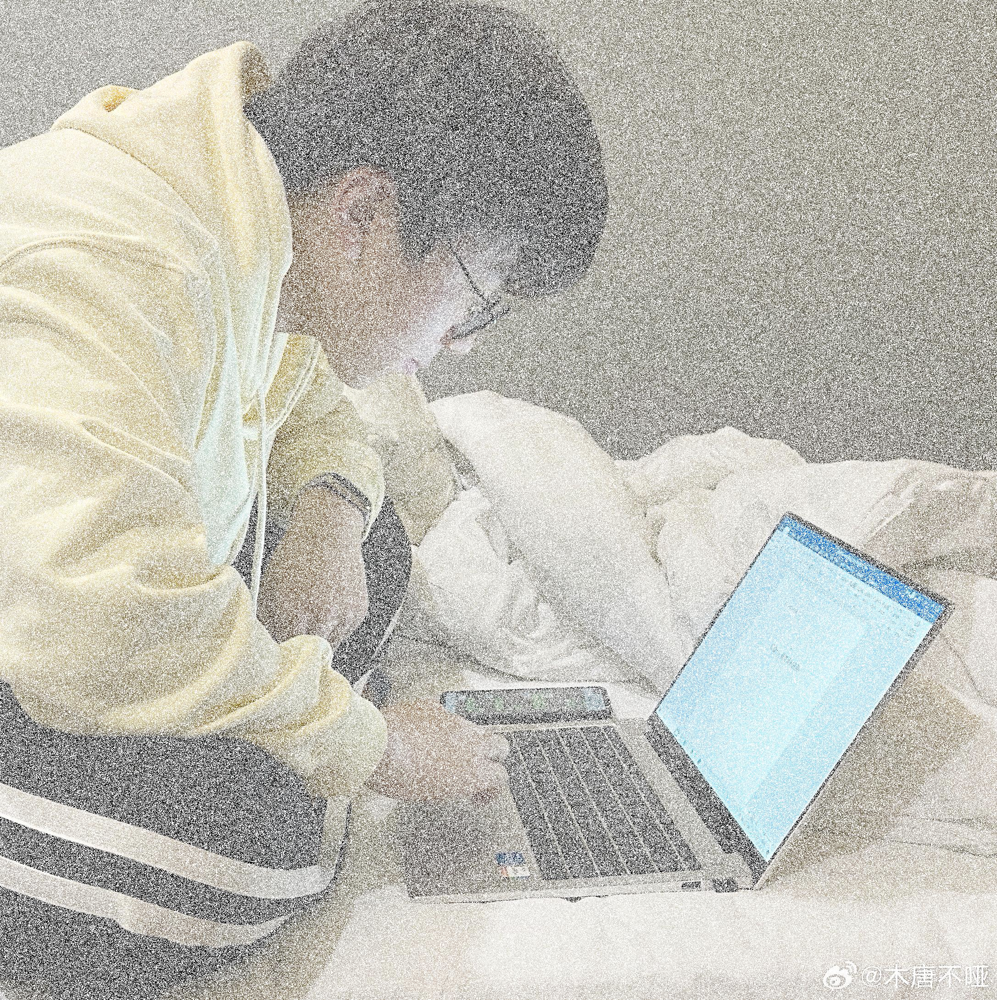
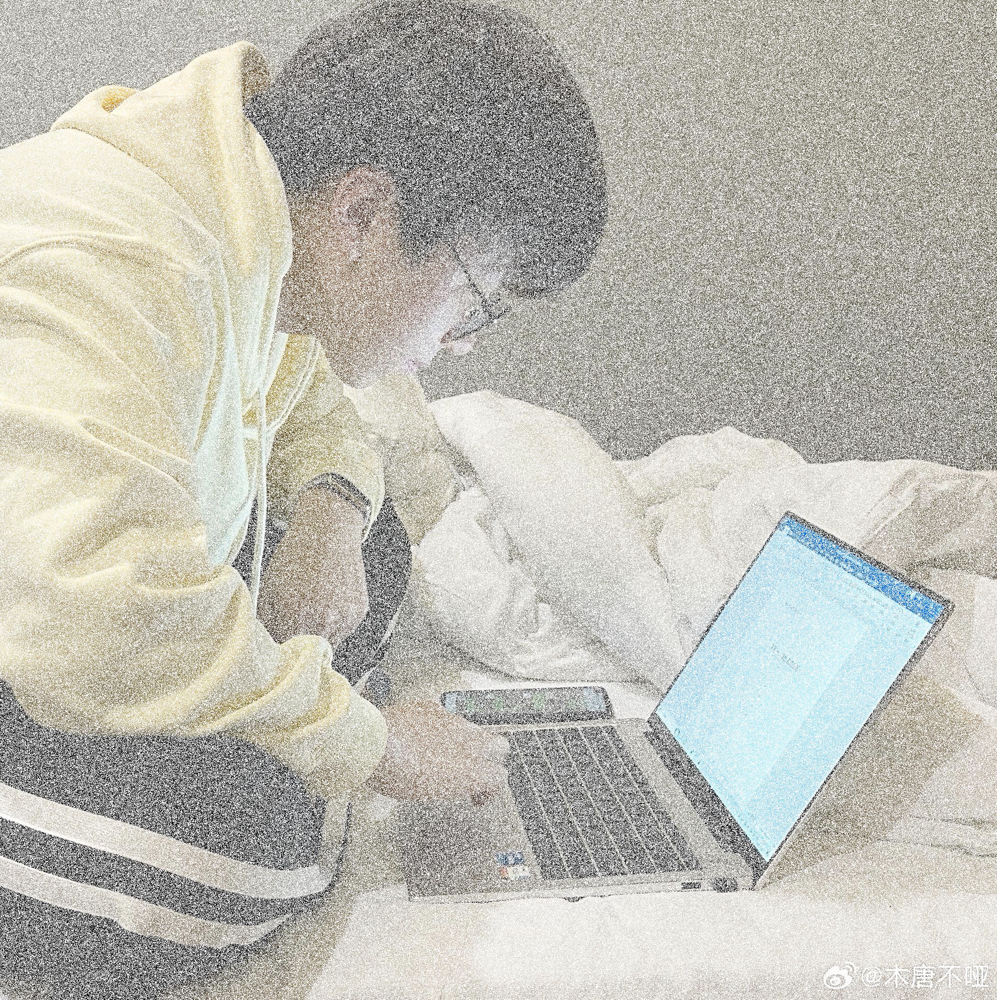

以下是根据你的更新需求**修改后的 `README.md` 文件**。我已将内容扩展为支持两种融合模式（正片叠底和线性减淡），并同时生成反转颜色图像。文件路径和生成图像名称都已更新以反映这些变化。

---

## 📌 README.md：拼好图（Blend Images - Multiply & Add）

# 拼好图 🖼️（Blend Images）

一个使用 Python 实现的图像融合工具，支持将指定文件夹下的多张图片使用两种混合模式融合成一张图像：

* 正片叠底（Multiply Blend）
* 线性减淡（Add Blend）

同时生成颜色反转版本，适用于图像合成、图像效果测试、数字艺术等应用场景。

---

## 🧩 功能介绍

* ✅ 自动读取指定文件夹下的所有图片
* ✅ 图像尺寸自动统一为第一张图片大小
* ✅ 支持两种图像融合算法：

  * 🎨 正片叠底（Multiply）
  * 🌟 线性减淡（Add）
* ✅ 自动生成对应的颜色反转图像
* ✅ 支持 PNG、JPG、JPEG 等主流图像格式

---

## 📂 项目结构

```
拼好图/
├── images/                        # 存放待融合图片的文件夹
│   ├── image1.png
│   ├── image2.jpg
│   └── ...
├── blend_images.py               # 主程序脚本
├── blended_add.png               # Add 融合图像
├── blended_add_inverted.png      # Add 融合 + 反转颜色
├── blended_multiply.png          # Multiply 融合图像
├── blended_multiply_inverted.png # Multiply 融合 + 反转颜色
└── README.md                     # 项目说明文档
```

---

## 🚀 使用方法

### 1. 克隆项目

```bash
git clone https://github.com/Peyjee-W/pin-hao-tu.git
cd pin-hao-tu
```

### 2. 安装依赖

确保你已安装 Python 3.6+，并使用如下命令安装依赖：

```bash
pip install pillow numpy
```

### 3. 准备图片

将你要融合的所有图片放入项目根目录下的 `images/` 文件夹。

> ⚠️ 所有图片将统一为第一张图片的尺寸。

### 4. 运行脚本

```bash
python blend_images.py
```

运行后将生成如下图像文件：

* `blended_add.png`：线性减淡融合
* `blended_add_inverted.png`：线性减淡融合 + 颜色反转
* `blended_multiply.png`：正片叠底融合
* `blended_multiply_inverted.png`：正片叠底融合 + 颜色反转

---

## 🧠 融合算法简介

### 🎨 正片叠底（Multiply Blend）

对每个像素执行以下操作：

```
Result = Image1 × Image2
```

得到更暗的融合图像，广泛用于 Photoshop 和图像编辑中。

### 🌟 线性减淡（Add Blend）

对每个像素执行以下操作：

```
Result = Image1 + Image2
```

得到更亮的图像，适用于增强亮部信息。

---

## 📷 示例效果

| 原图1                    | 原图2                    | Multiply 融合            | Add 融合                | Multiply + 反转         | Add + 反转              |
| ---------------------- | ---------------------- | ------------------------ | ----------------------- | ------------------------ | ------------------------ |
|  |  |  |     |  |  |

---

## 💡 TODO

* [ ] 支持更多混合模式（如滤色、柔光、叠加等）
* [ ] 图像尺寸智能裁剪而非拉伸
* [ ] 添加 GUI 界面，支持拖拽加载图片

---

## 📄 License

MIT License © 2025 \[Peyjee-W]

---

## 🤝 贡献者

欢迎提交 Issue 或 Pull Request 参与改进项目！

---

如果你也需要我帮你生成实际的 `blend_images.py` 脚本文件对应这个 README，我可以立刻生成。需要吗？
